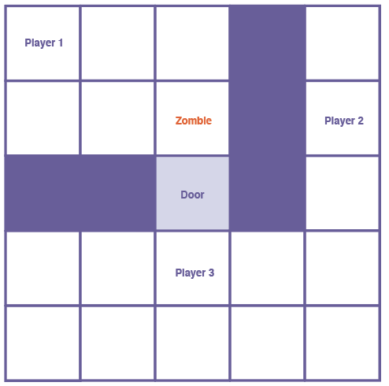
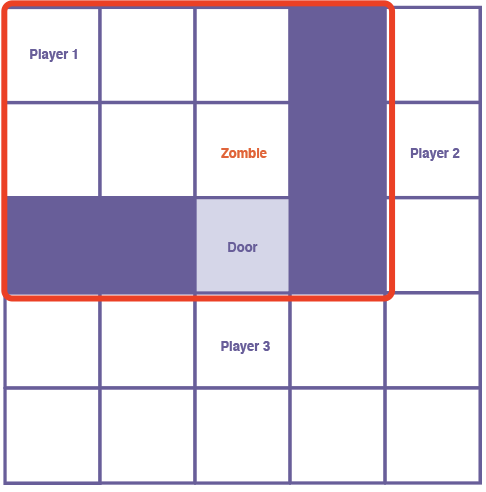
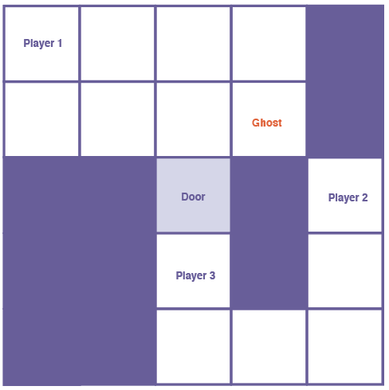

The file describes the strategies for determining the next move of adversaries:
### Zombie
Zombie can only move in the zoom, and cannot get to the door tile, get out off the zoom.

rules
1. get the zoom tiles for each zombie.
2. get the player posn list of all achievable files.
3. find the nearest player in the posn list, move towards that player.
4. if there are two players have same distance, select the first player in the order, then, make a movement.

Look at this situation (Exceptional case):
There are three players around the zombie, however, there is only one player inside the room. According to our rule, zombie cannot get out of the room, so player 2 and player 3 are not accessible. Following with step 1&2, zombie only needs the room view and excludes those players outside the room (showing in the second image)

According to step 3, zombie lock the target - player 1, it finds the possible move in four directions, comparing each path distance to that nearest player, then, make a move.

Prediction path:

UP: 2 steps

DOWN: X

LEFT: 2 steps

RIGHT: X

Zombie can move towards UP or LEFT.

Then loop three steps.

In normal case, it is pretty easy for zombie to identify the nearest player in the room.
So for each movements: for each tile, get its distance to each player, and then keep the lowest one. Then, there are 4 distances for each of the 4 potential tiles. Keep looping.

### Ghost
Ghost can move everywhere in the level: if they move on wall tile, they were randomly assigned to the new tile in the level.

rules
1. find the nearest player in the level.
2. move forward to that player by one tile.
3. if there are two players have same distance, select the first player in the order, then, make a movement.

Look at this situation (Exceptional case):

According to step 1, the nearest player is player 2.
Ghost could move downsides or leftside to player 2, since they all walls, ghost can move to a random place. Then keep looping.

